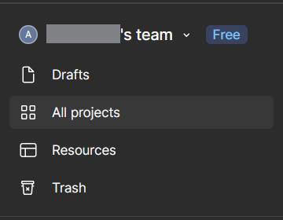
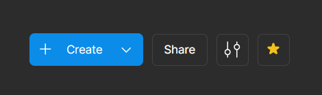
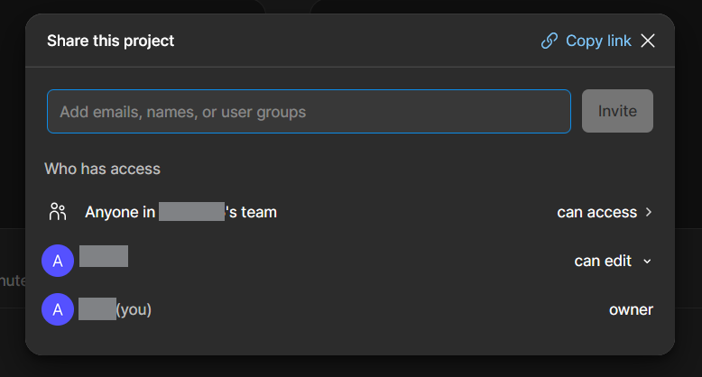
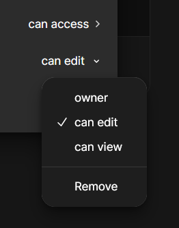

# Create a Collaborative Project

This article will walk you through how to start a project in Figma and add collaborators to it.

## Create a Project

Before we can add collaborators, we need a project to add them to. A project is a collection of all your collaborative files, which can be accessed, created and/or deleted by any of the collaborators you add.

1.  **Navigate** to the top left panel of Figma’s homepage and **click** all projects.

    

2.  **Navigate** to the top right corner and **click** the blue project button.

    This should trigger a popup and a series of text inputs to name your project and add collaborators.

    

3.  **Name** your project

    !!! info

        Your collaborators will be able to see your project name when you send them the invitation to join, so be sure to name it something they will recognize.

4.  **Input** the emails of your collaborators

    !!! warning

        All emails you add must have an associated Figma account to work. If the email does not have a Figma account, your collaborator will not be able to access the Project.

## Editing Collaborators and Permissions

If you want to add a new collaborator or change an existing collaborator’s permissions, you can do that in the ‘share’ settings.

1. **Navigate** to top right corner in the project and **click** the grey share button.

    

    This will open the share settings. Here, you can add new collaborators and change permissions.

    

### Add a new Collaborator

1. **Input** the email of the collaborator you want to add in the input field and **click** the invite button

### Change a collaborator’s permissions

1. **Find** the collaborator you want to edit in the share settings. **Click** on the drop down menu to the right of their name labelled ‘can edit’.

2. **Click** on the permissions you want that collaborator to have

!!! info

    *Can Edit* permissions grant the collaborator the ability to edit, create, and delete files within the project

    *Can View* permissions grant the collaborator the ability to look at files within the project. They cannot edit, create, or delete anything.

    *Owner* permissions go to the creator of the project and cannot be transferred.

With a project made and collaborators invited to it, you can begin working with members of your team to design and prototype. In the [next article](task2.md), we’ll look at how to set up a design file for your team to access.
