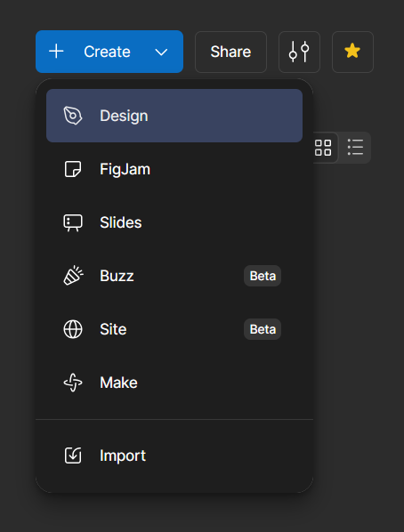
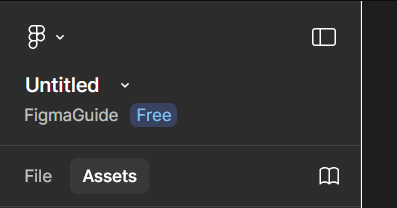
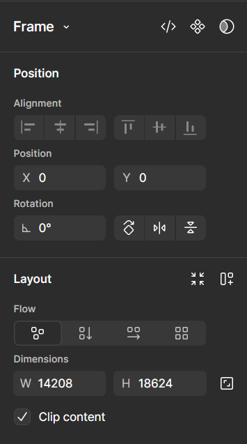
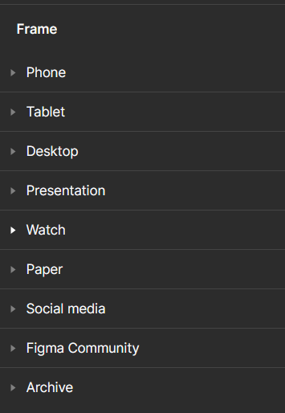

# Create a Design File

This article will walk you through how to create a design file within a collaborative Figma project, as well as the most common design tools you will use.

## Create a Collaborative File

Now that you have a project and have added collaborators to it, you can create a number of different file types your team members can contribute to. This tutorial will cover the Design file type.

1.  **Navigate** to the top right corner in your project and click the blue create button.

2.  **Click** ‘Design’
    

    Figma will take you to a blank design document.

3.  Navigate to the top of the right panel in the design document and **click** on ‘Untitled’

    !!! info

        This is the name of your file. Projects can get very large very quickly, so it is recommended to name all your files.

    

4.  **Input** the name of your file and **press enter**.

    !!! warning

        When you export this file, the file name will default to the name you give it in Figma. To follow best practices and avoid file path issues, choose a short and descriptive name. Avoid spaces and instead use a naming convention like [camelCase](glossary.md) or replace the spaces with dashes or underscores.

    Currently, this file has no canvas to work on. You must create a page to work on called a frame

5.  **Create** a Frame using the tool that looks like grid lines in the bottom center menu.

    ")

### Drag out a Frame

1. **Select** the frame tool, **click** and **drag** a white rectangle with your mouse. This is your frame.

    With the frame selected, the rightmost panel of the workspace will become a frame settings menu.

    

2. **Click** on the width and height input fields under ‘Dimensions’ to specify exact dimensions. **Press enter** when you are done.

### Use Preset

1. **Select** the frame tool, **click** on one of the preset frames in the right panel to insert it into the workspace.

    

    You can move or resize your frame at any time by selecting the frame tool ( F ) and **clicking** on the frame.

### Select Tool

To manipulate an element on the page, you need to use the select tool.

1. **Navigate** to the bottom main menu and **click** the cursor button to activate the select tool ( V ).

    This tool will allow you to select and move elements in the workspace.

    ")

### Move Tools

The hand tool allows you to move around the workspace.

1. **Activate** the Hand Tool ( H ). Your cursor should become a hand.
2. **Click** and **drag** your mouse to move around the workspace. Release your mouse button to reposition.

    Additionally, you can activate the hand tool in the main menu: [ select drop down → hand tool ]

3. **Deactivate** hand tool by (V) or by selecting the select tool.

You can zoom in and out of the workspace to see elements better.

1. **Click** on the percent number drop down menu under the ‘share’ button and select a zoom option. Additionally, you can use (ctrl + +) to zoom in and (ctrl + -) to zoom out one increment at a time.

## Conclusion

Now you can create a collaborative design file and move about the workspace confidently. In the [next article](task3.md), we’ll look at how to use the design tools to begin creating some visuals.
