# Use Figma’s Design Tools

With a design file and basic knowledge about how to move around the workspace, we can now explore the design tools that Figma has to offer.

## Shape Tools

1. **Navigate** to the main menu bar and **click** the square icon to activate the rectangle tool ( R )

    ")

2. **Click, hold, and drag** to create a preview of a rectangle shape that you want to create on the workspace. **Release** the click to create the shape.

Create other shapes by selecting from any of the options in the rectangle tool’s dropdown menu:

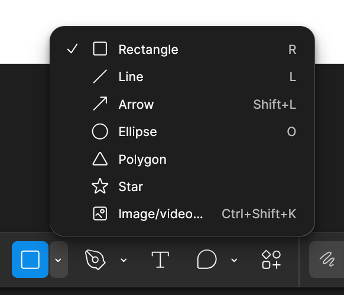

!!! info

    **Hold the shift key** while dragging out a shape to create a shape with a perfect aspect ratio.

With any shape tool selected or by **clicking** on a shape on the frame to select it, the right panel in the interface will turn into a shape menu with three main settings:

- Position
- Layout
- Appearance

### Position Settings

With an existing shape selected, position settings allow you to place the selected shape precisely.

#### Alignment

!!! note

    To use these settings, the selected item needs to be in a frame or multiple items need to be selected so that they can be positioned in reference to each other.

    To select multiple items **hold the shift key** and **click** the items you want selected.

    Alternatively, you can **select** the move tool ( V ), **click**, **hold**, and **drag** to create a box shape over the items you wish to select, and **release the click** to select them.

Hover over each alignment icon to see how it will align your shapes. The light grey line each icon represents in which direction your shapes will be aligned.

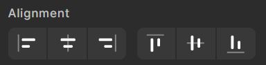

The options in the left panel alter horizontal alignment. From left to right, these options are:

- Align Left
- Center Horizontally
- Align Right

The options in the left panel alter vertical alignment. From left to right, these options are:

- Align Top
- Center Vertically
- Align Bottom

#### Position

If you want to be more precise about the position of your shape, you can input numerical values for the vertical and horizontal positioning.

1. **Double click** on the input field labelled ‘X’ and **input** a value in pixels. **Press enter** to implement your changes

2. **Double click** on the input field labelled ‘Y’ and **input** a value in pixels. **Press enter** to implement your changes

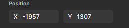

### Layout Settings

Specific values for a shape's size can be specified similarly to how you [specify its position](#position).

1. **Double click** on the input field labelled ‘W’ and **input** a width. **Press enter** to implement your changes

2. **Double click** on the input field labelled ‘H’ and **input** a height. **Press enter** to implement your changes

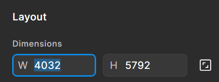

To keep the current ratio of your shape while scaling up/down, click on the square icon next to the width and height fields to enable ratio lock. When you scale your shape, the ratio from width to height will stay the same.

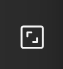

### Appearance Settings

In the appearance settings, you can change a shape’s stroke (outline), fill, and add effects. These options may vary from shape to shape, but the consistent ones will be _Opacity_, _Stroke_ and _Fill_. You can find the following options in the right panel of the workspace with a shape selected.

#### Opacity

Opacity refers to how transparent an image is.

1. **Double click** on the opacity input field under ‘appearance’

2. **Input** a percent from 1 - 100, 1 being the least visible and 100 being fully visible. **Press enter** to save your changes.

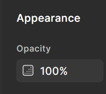

#### Fill

The fill is the inside of a shape.

1. **Navigate** to the fill section of the appearance settings.

    If you have a [hex code](/docs/glossary.md) for your desired colour, **double click** the field where the current hex code is, **input** your hex code, and **press enter** to save your changes.

    Otherwise, **click** on the coloured square next to the hex code.

    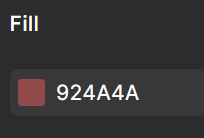

    This will open a pop-up menu containing a colour graph and 2 sliders.

2. **Click and drag** the circle to the general colour you want on the top most rainbow slider.

    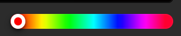

3. **Click and drag** the circle on the large colour graph to determine the colour’s lightness/darkness and saturation.

    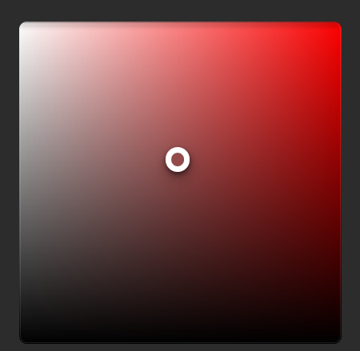

!!! note

    Your shape will have a fill by default, but you can always remove it by clicking the minus icon to the bottom right of the fill settings.

#### Stroke

The stroke is the outline of the shape. You can alter its width, colour, and opacity. Your shape may not have a stroke by default.

1. **Click** the plus button next to the _Stroke_ setting in the right-hand panel to add a stroke to your shape

    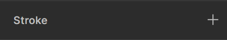

2. **Edit** it’s width by **clicking** on the weight input field and **inputting** in a numerical value.

!!! info

    You can change a stroke’s colour and opacity the same way you do for the fill.

## Image/Video Tool

You can import any photos or videos on your computer to your Figma file with this tool.

1. **Navigate** to the rectangle tool’s drop down menu and **click** ‘Image/Video’ ( Ctrl + Shift + K )

2. **Select** from the local files pop-up which media to add to your project.

Alternatively, you can drag and drop files from another window into the Figma workspace.

## Pen Tool

The pen tool can be used to create custom shapes.

1. **Navigate** to the main menu bar and **click** the pen icon to activate the pen tool. ( P )

    ")

2. **Click** anywhere on the frame to begin drawing a shape.

    This creates a point. The created point is represented with a solid blue circle. As you move your cursor around the page, a line connecting the point and your cursor will appear. Under your cursor will be the outline of a blue circle.

    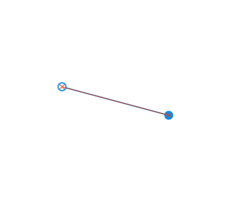

3. **Click** somewhere else on the frame to create a second point.

    This will connect to your second point, forming a line.

4. **Click** on your starting point to complete the shape.

    This will close the element, making it a shape that can now have a fill colour.

    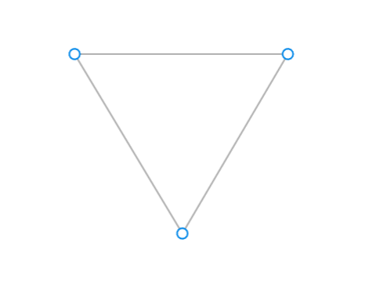

!!! Success

    To create an element recognized as a shape by Figma, you need at least three connected points. You will know if you have successfully closed a shape when your cursor no longer has a line attaching it to your last point.

You can create curved lines by **clicking** to create the point, and before releasing the click, **drag** your mouse to curve the point at different angles.

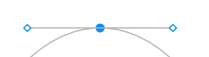

This will create two handles attached to your point, called bezier handles. You can adjust the intensity and direction of your curve by adjusting these handles.

!!! info

    To make points or curves in equal increments, **hold the shift key**.

With the pen tool selected, your right panel will turn into the Vector settings panel, which operates the same as the shape settings panel. Give your custom shape a fill, stroke, and change its opacity the same way you would a shape.

## Conclusion

With this knowledge, you can play around with Figma’s design tools to create all kinds of visuals. In the [next article](task4.md), we’ll look at how to prototype these design elements into interactive menu items and buttons, as well as how to test your application right in Figma.
