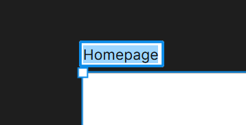
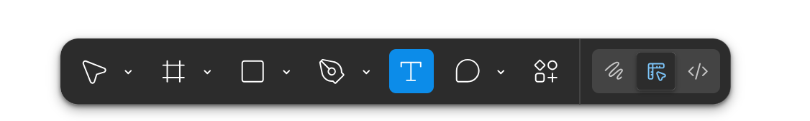
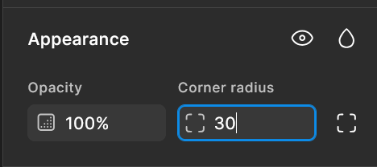
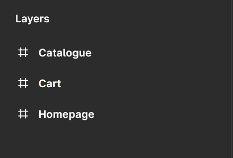
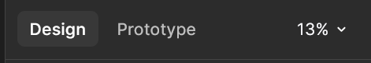
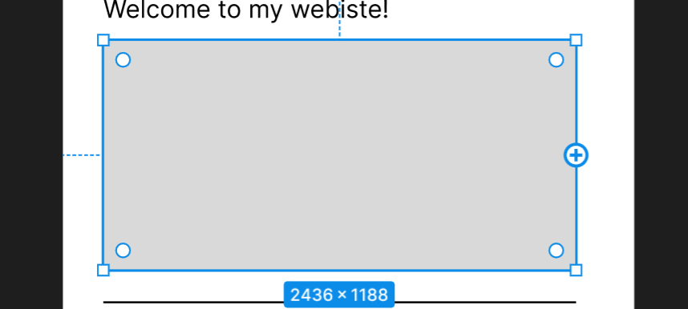
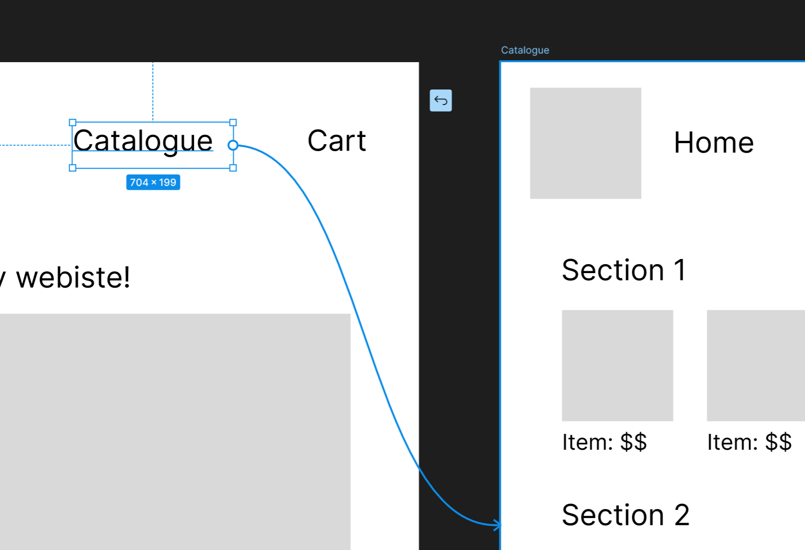
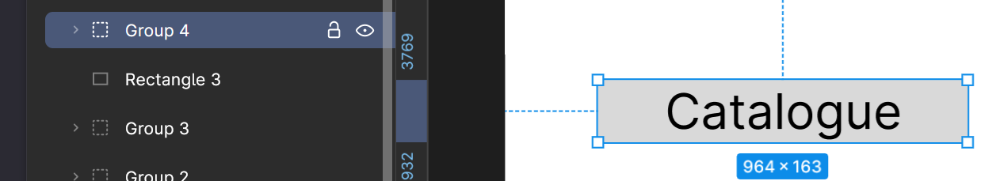
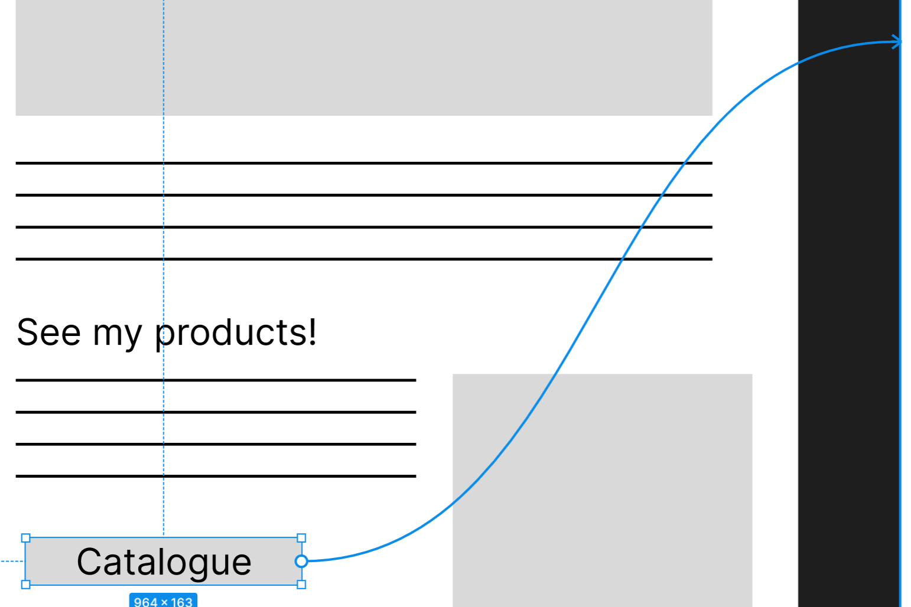
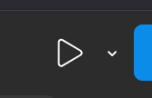

# Use Figma’s Prototyping Tools

In this article we will cover how to prototype your designs, which includes adding text, buttons, multiple frames, and testing.

## Multiple Frames

Prototyping in Figma works much like slideshows do. In order to link one page to the next, you will need at least two frames in your figma workspace.

1. Create a frame using the frame tool (F) and copy it by using the shortcut (CTRL + C) and pasting it with (CTRL + V)

2. Label your frames by **double clicking** on the text to the top left of the frame. **Enter** the name of your frame and press enter when done.

    

!!! note

    Large applications will require many frames, so ensure your labels are clear to everyone in your project.

## Buttons and Text

Often, application mocks have clickable text such as menu items or buttons that lead the user to different pages. While Figma doesn’t have an exact tool for creating these, you can easily create them yourself.

### Create Text

1. Navigate to the main menu and **click** the T icon to activate the text tool ( T )

    

2. **Click and drag** out a text box. Type out your text, and click anywhere out of the text box when done.

3. Edit existing text by **double clicking** on the text box, re-entering the text, then **clicking** out of the text box when done.

### Create Buttons

1. Create the button shape of your choice using the [shape tools](task3.md/#shape-tools).

    Most buttons are rounded. You can round the corners of any shape created with the shape tool in the appearance settings under ‘corner radius’

2. **Click** on the corner radius input field and enter your desired radius.

    

3. Optional: Create text on top of the button to create a button with text

    If your text appears underneath the button shape, you can alter the layer it appears on in the layer settings

## Layer Settings

If any of your compound elements are not appearing in the order that you want them to, you can shift their order in the layer panel on the left side of the workspace.

Layers with the frame icon next to them are your frames.

1. **Click** on the dropdown menu icon to see what elements are on that frame.

2. **Click and hold** on the element you want to change the order of, then simply drag it higher or lower to change which layer it appears on.

!!! note

    This panel can quickly get overwhelming, so always name layers by double clicking on their existing name, typing a new one, and pressing enter.

## Connections

Once your design and clickable elements on your frames have been created, you can connect each button or menu item to the page it will redirect the user to.

1. Open your prototype panel by navigating to the top of the right panel in the workspace and **clicking** prototype.

This enters prototype mode. In this mode, all your elements and frames will have a blue circle with a plus in it, called a connection node.

1. **Click** on an element you want to be interactive and **click and hold** its connection node and **drag** it to the element you want it to connect to.

In this case, I’ve clicked on the catalogue menu item’s connection node and connected it to my catalogue frame by dragging it to the edge of the frame.

Next, I want my call to action button on the homepage to also redirect the user to the catalogue page.

## Add Functionality to Buttons

1.  **Select** both the button shape and the text by **holding shift and clicking** both elements.

2.  Group these elements together by using the shortcut (CTRL + G)

    

    A new element in the layers panel will be created, typically called 'Group 1'. Rename this group by **double-clicking** its title and **inputting** your desired name for the group.

    Grouped layers are much easier to keep track of than a loose compound element, especially when prototyping.

    !!! note

         Grouping elements is a great way to keep your layers panel a little tidier.

3.  With the button group selected, **click** its connection node and **drag** it to the desired page.

    

!!! note

    You can access more complicated prototype settings by clicking on a connection arrow. This will open the interactions panel, which allows you to change all sorts of settings like different trigger events, actions, and animations.

    These will not be covered in this documentation, but are excellent skills to learn for intermediate designers and devs.

## Testing

Figma has a built-in testing feature for you to try out your mock up.

1. Navigate to the top right of the right panel and **click** the play button.

    

    This will open a new tab in your browser where you can test your application.

    Depending on the dimensions of your frame, your mock up might appear too small or large to fit on the screen.

2. In the top right corner of the page, **click** on the sliders icon

    

3. Choose the size settings you want

4. Click on any of your interactive elements to see how they work.

!!! note

    If you forget which buttons are clickable, just **click** anywhere on the screen and the elements with connections will be highlighted in blue.

Now you and your team can test your design on real people, get feedback, and improve your mock ups within Figma.
